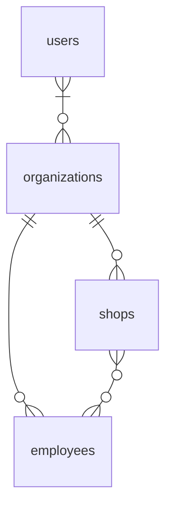
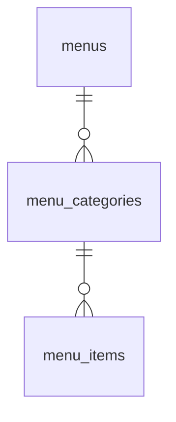

## Migration

```
./vendor/bin/sail php artisan migrate --seed --database=pgsql
```

```
./vendor/bin/sail php artisan migrate:fresh --seed --database=pgsql
```

## Test

```
./vendor/bin/sail test
```

```
./vendor/bin/sail test tests/Feature/GraphQL/Mutations/LoginTest.php
```

### Use Xdebug

```
./vendor/bin/sail debug test
```

```
./vendor/bin/sail debug test tests/Feature/GraphQL/Mutations/LoginTest.php
```

### Use Better Pest

`Cmd + Ship + p` > `Better Pest: run`

## ER





## Query And Mutation

http://localhost/graphiql

```graphql
query {
    organization(id: "00000000-0000-0000-0000-000000000000") {
        id
        name
        users {
            id
            name
        }
        shops {
            id
            name
        }
        employees {
            id
            name
        }
    }
}
```

```graphql
mutation {
    createShop(
        name: "hoge"
        organization_id: "00000000-0000-0000-0000-000000000000"
    ) {
        id
        name
        organization {
            id
            name
        }
        employees {
            id
            name
        }
    }
}

mutation {
    updateShop(
        id: "00000000-0000-0000-0000-000000000000"
        name: "hoge"
        employees: {
            sync: ["00000000-0000-0000-0000-000000000000"]
        }
    ) {
        id
        name
        organization {
            id
            name
        }
        employees {
            id
            name
        }
    }
}
```

## VScode Extensions

### PHP Intelephense

https://marketplace.visualstudio.com/items?itemName=bmewburn.vscode-intelephense-client

### PHP Namespace Resolver

https://github.com/MehediDracula/PHP-Namespace-Resolver

### Better Pest

https://github.com/m1guelpf/better-pest


### .vscode/settings.json

```json
{
    "editor.formatOnSave": true,
    "[php]": {
        // PHP Intelephense
        "editor.defaultFormatter": "bmewburn.vscode-intelephense-client"
    },
    // PHP Namespace Resolver
    "namespaceResolver.sortAlphabetically": true,
    "namespaceResolver.sortOnSave": true,
    // Better Pest
    "better-pest.docker.enable": true,
    "better-pest.docker.command": "./vendor/bin/sail",
    "better-pest.pestBinary": "debug test",
    "better-pest.docker.paths": {
        "your workspace": "/var/www/html" // set your workspace
    },
}
```

### .vscode/launch.json

```json
{
    // IntelliSense を使用して利用可能な属性を学べます。
    // 既存の属性の説明をホバーして表示します。
    // 詳細情報は次を確認してください: https://go.microsoft.com/fwlink/?linkid=830387
    "version": "0.2.0",
    "configurations": [
        {
            "name": "Listen for Sail Xdebug",
            "type": "php",
            "request": "launch",
            "port": 9003,
        }
    ]
}
```