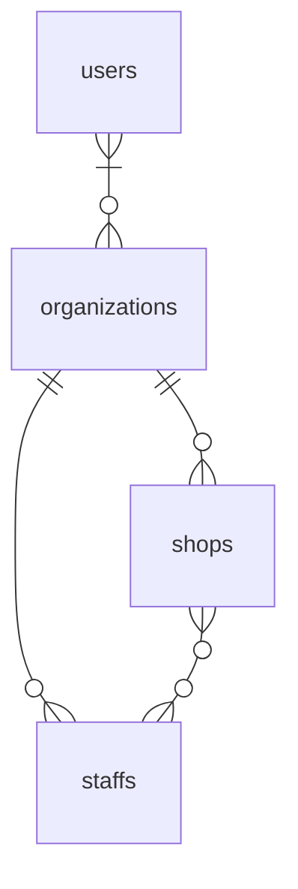
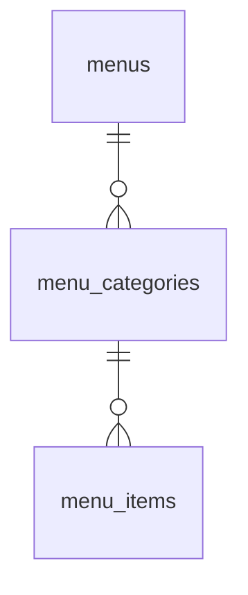

## Migration

```
./vendor/bin/sail php artisan migrate --seed --database=pgsql
```

```
./vendor/bin/sail php artisan migrate:fresh --seed --database=pgsql
```

## ER





## Query And Mutation

http://localhost/graphiql

```graphql
query {
    organization(id: "00000000-0000-0000-0000-000000000000") {
        id
        name
        users {
            id
            name
        }
        shops {
            id
            name
        }
        staffs {
            id
            name
        }
    }
}
```

```graphql
mutation {
    createShop(
        name: "hoge"
        organization_id: "00000000-0000-0000-0000-000000000000"
    ) {
        id
        name
        organization {
            id
            name
        }
        staffs {
            id
            name
        }
    }
}
```
