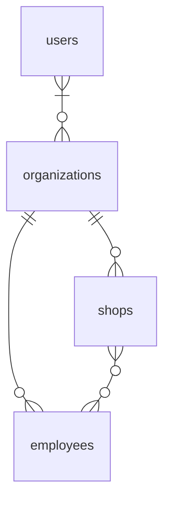
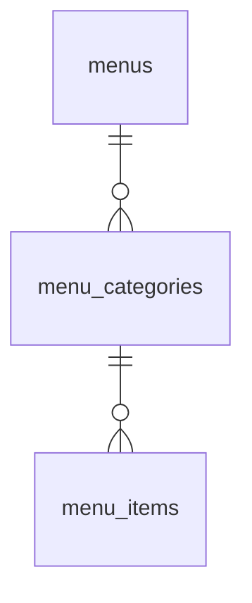

## Migration


```
./vendor/bin/sail php artisan migrate
```

```
./vendor/bin/sail php artisan migrate --seed
```

```
./vendor/bin/sail php artisan migrate:rollback --step=1
```

```
./vendor/bin/sail php artisan migrate:fresh --seed
```

## Test

```
./vendor/bin/sail test
```

```
./vendor/bin/sail test tests/Feature/GraphQL/Mutations/LoginTest.php
```

### Use Xdebug

```
./vendor/bin/sail debug test
```

```
./vendor/bin/sail debug test tests/Feature/GraphQL/Mutations/LoginTest.php
```

### Use Better Pest (VSCode Extension)

`Cmd + Ship + p` > `Better Pest: run`

## ER





## Query And Mutation

http://localhost/graphiql

```graphql
query {
    organization(id: "00000000-0000-0000-0000-000000000000") {
        id
        name
        users {
            id
            name
        }
        shops {
            id
            name
        }
        employees {
            id
            name
        }
    }
}
```

```graphql
mutation {
    createShop(
        name: "hoge"
        organization_id: "00000000-0000-0000-0000-000000000000"
    ) {
        id
        name
        organization {
            id
            name
        }
        employees {
            id
            name
        }
    }
}

mutation {
    updateShop(
        id: "00000000-0000-0000-0000-000000000000"
        name: "hoge"
        employees: {
            sync: ["00000000-0000-0000-0000-000000000000"]
        }
    ) {
        id
        name
        organization {
            id
            name
        }
        employees {
            id
            name
        }
    }
}
```

## Recommend VScode Settings

### Extensions (@recommended)

| extension              | purpose                         | link                                                                                    |
| ---------------------- | ------------------------------- | --------------------------------------------------------------------------------------- |
| PHP Intelephense       | PHP開発支援および、フォーマット | https://marketplace.visualstudio.com/items?itemName=bmewburn.vscode-intelephense-client |
| PHP Namespace Resolver | フォーマット（import順序）      | https://github.com/MehediDracula/PHP-Namespace-Resolver                                 |
| Better Pest            | GUIでのテスト実行               | https://github.com/m1guelpf/better-pest                                                 |

### .vscode/settings.json

```json
{
    "editor.formatOnSave": true,
    "[php]": {
        // PHP Intelephense
        "editor.defaultFormatter": "bmewburn.vscode-intelephense-client"
    },
    // PHP Namespace Resolver
    "namespaceResolver.sortAlphabetically": true,
    "namespaceResolver.sortOnSave": true,
    // Better Pest
    "better-pest.docker.enable": true,
    "better-pest.docker.command": "./vendor/bin/sail",
    "better-pest.pestBinary": "debug test",
    "better-pest.docker.paths": {
        "your workspace": "/var/www/html" // set your workspace
    },
}
```

## Deploy

### アクセストークンを生成するためにPassportが必要とする暗号化キーを生成 & OAuth Client作成
```
php artisan passport:install

# php artisan passport:keys 暗号化キーを生成のみ行う場合
```

以下の環境変数に生成したClientを設定。SecretはDBのデータを確認して埋める
```
# for passport
PASSPORT_PERSONAL_ACCESS_CLIENT_ID=1
PASSPORT_PERSONAL_ACCESS_CLIENT_SECRET=

# for lighthouse-graphql-passport-auth
PASSPORT_CLIENT_ID=2
PASSPORT_CLIENT_SECRET=
```
