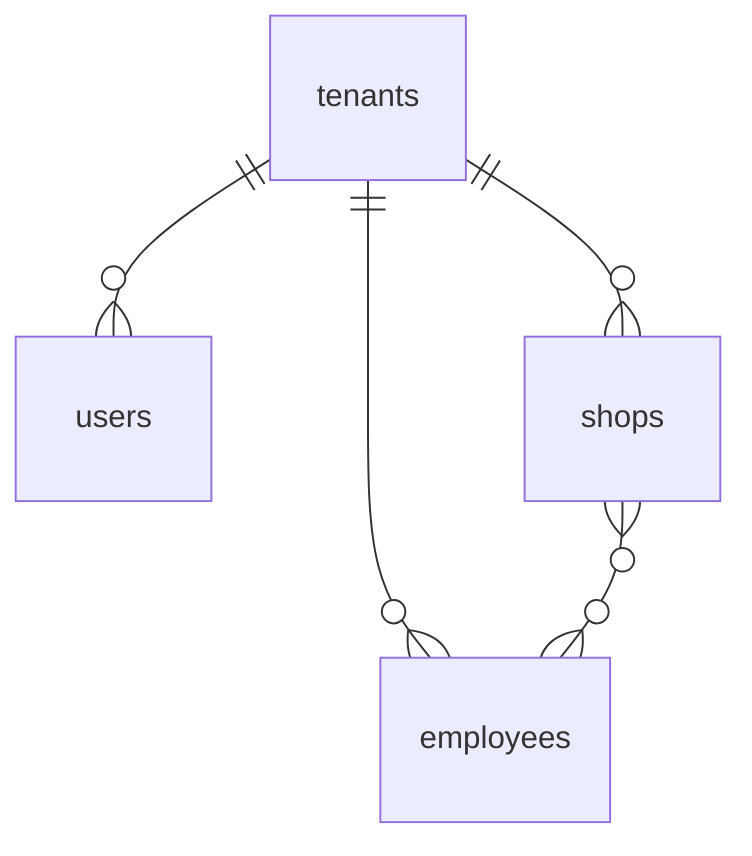
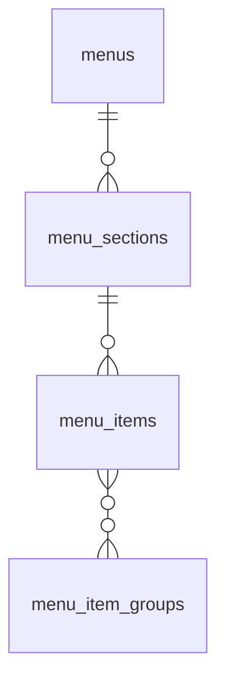
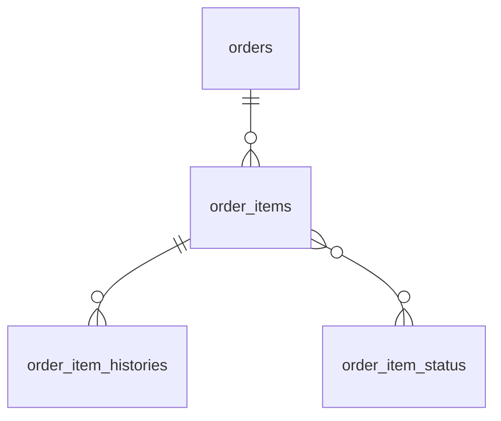

## Tenant

```mermaid
erDiagram
    tenants ||--o{ users : ""
    tenants ||--o{ shops : ""
    tenants ||--o{ employees : ""
    shops }o--o{ employees : ""
```

## Menu

```mermaid
erDiagram
    menus ||--o{ menu_sections : ""
    menu_sections ||--o{ menu_items : ""
    menu_items }o--o{ menu_item_groups : ""
```

## Order

```mermaid
erDiagram
    orders ||--o{ order_items : ""
    order_items ||--o{ order_item_histories : ""
    order_items }o--o{ order_item_status : ""
```
